# Machine-Unlearning-In-Applied-Contexts

### Figures

### Figure 1 — AE Reconstructions
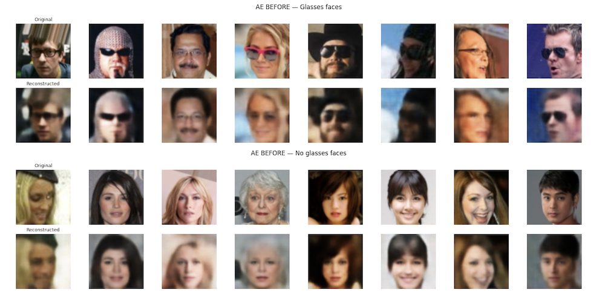
Generated in [GlassesAutoEncoder.ipynb, Cell 5](https://colab.research.google.com/drive/1QCjcidtB0i2CBfFHQbSnCGguAjw1Yu4J#scrollTo=3zBDP_IEDp4U).

### Figure 2 — GA Glasses Faces
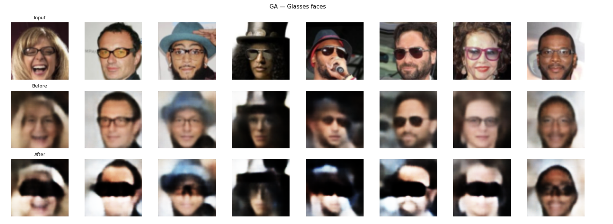
Generated in [GlassesAutoEncoder.ipynb, Cell 6](https://colab.research.google.com/drive/1QCjcidtB0i2CBfFHQbSnCGguAjw1Yu4J#scrollTo=DRbpA9NgL4CI).

### Figure 3 — GA No-Glasses Faces
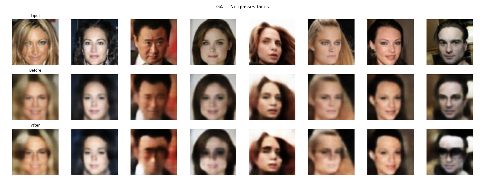
Generated in [GlassesAutoEncoder.ipynb, Cell 6](https://colab.research.google.com/drive/1QCjcidtB0i2CBfFHQbSnCGguAjw1Yu4J#scrollTo=DRbpA9NgL4CI).

### Figure 4 — Random Noise Reconstructions
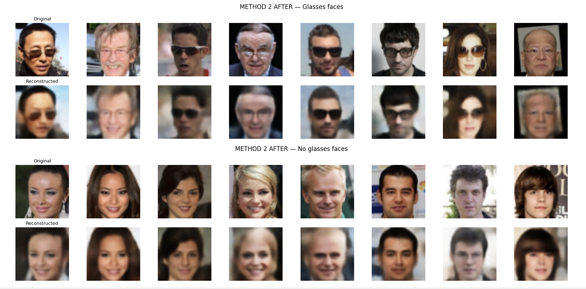
Generated in [GlassesAutoEncoder.ipynb, Cell 7](https://colab.research.google.com/drive/1QCjcidtB0i2CBfFHQbSnCGguAjw1Yu4J#scrollTo=BXS-e7tiEpPF).

### Figure 5 — Teacher Reconstructions
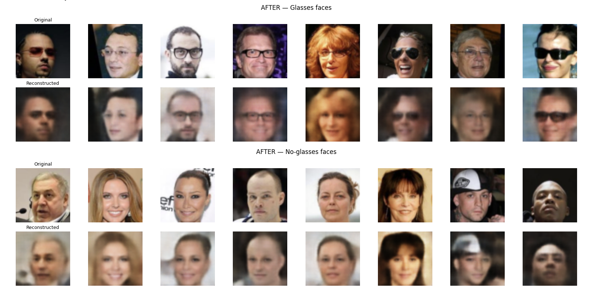
Generated in [GlassesAutoEncoder.ipynb, Cell 8](https://colab.research.google.com/drive/1QCjcidtB0i2CBfFHQbSnCGguAjw1Yu4J#scrollTo=nV2TgKUMFgYx).

### Figure 6 — VAE Gradient Ascent Forget Set (Angelina Jolie)
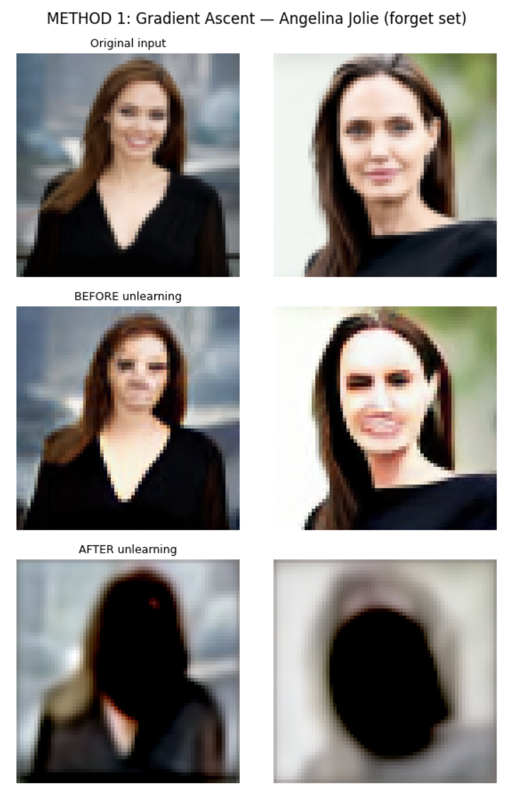
Generated in [VAE_On_Individual_Celebrities.ipynb](https://colab.research.google.com/drive/1XHcxZ6gEbUwu-8ir8mK600_5V3pONTJZ#scrollTo=Mu5FqWWYPmLI).

### Figure 7 — VAE Gradient Ascent Retain Set (Other Celebrities)
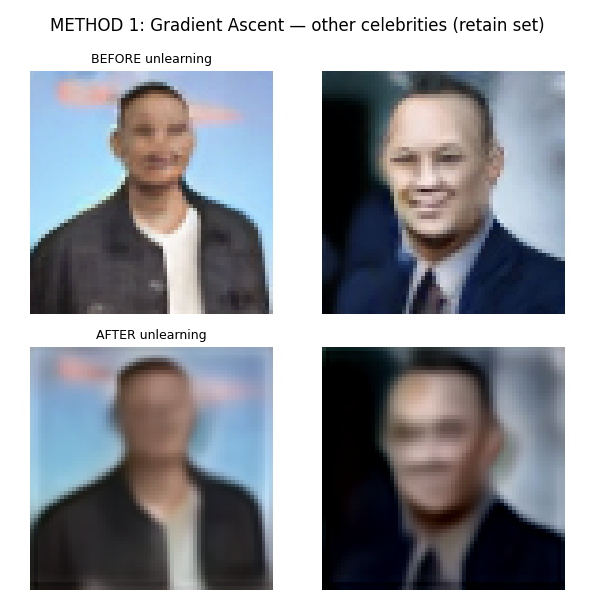
Generated in [VAE_On_Individual_Celebrities.ipynb](https://colab.research.google.com/drive/1XHcxZ6gEbUwu-8ir8mK600_5V3pONTJZ#scrollTo=Mu5FqWWYPmLI).

### Figure 8 — VAE Noise Targeting Forget Set (Angelina Jolie)
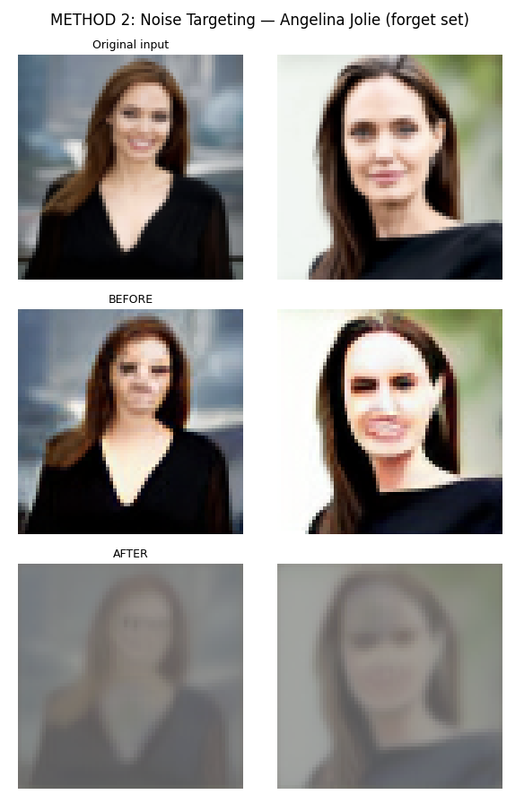
Generated in [VAE_On_Individual_Celebrities.ipynb](https://colab.research.google.com/drive/1XHcxZ6gEbUwu-8ir8mK600_5V3pONTJZ#scrollTo=SRHWPTLi60yf).

### Figure 9 — VAE Noise Targeting Retain Set
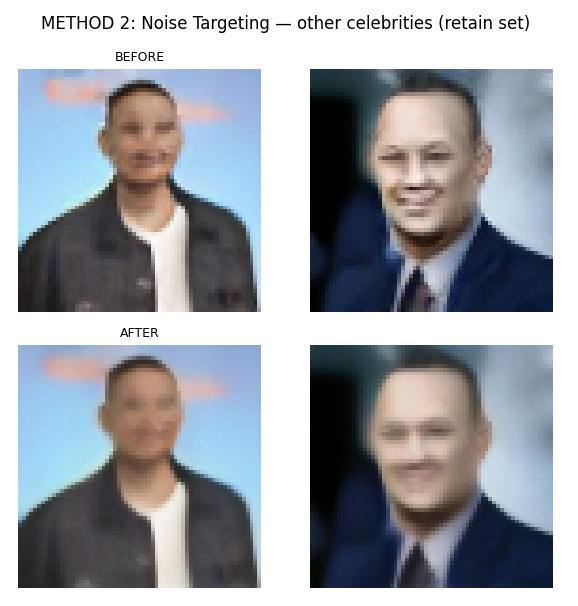
Generated in [VAE_On_Individual_Celebrities.ipynb](https://colab.research.google.com/drive/1XHcxZ6gEbUwu-8ir8mK600_5V3pONTJZ#scrollTo=SRHWPTLi60yf).

### Figure 10 — VAE Bad Teacher Forget Set (Angelina Jolie)
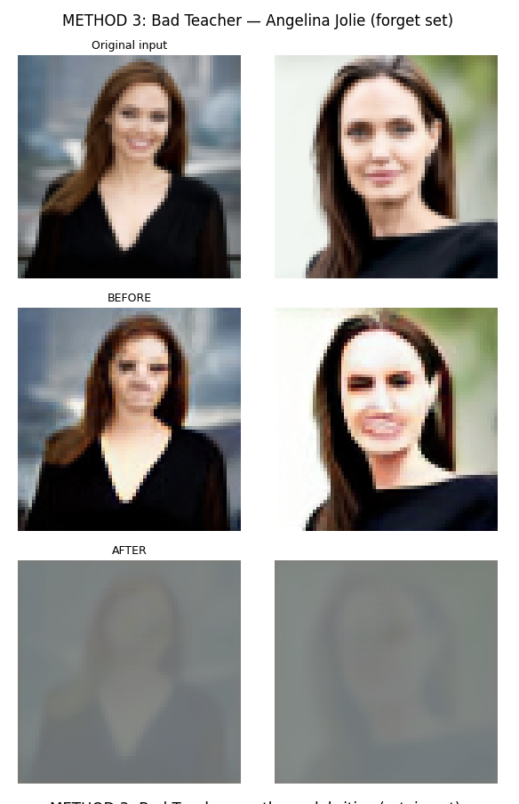
Generated in [VAE_On_Individual_Celebrities.ipynb](https://colab.research.google.com/drive/1XHcxZ6gEbUwu-8ir8mK600_5V3pONTJZ#scrollTo=ZD-mvMT1O89L).

### Figure 11 — VAE Bad Teacher Retain Set (Other Celebrities)
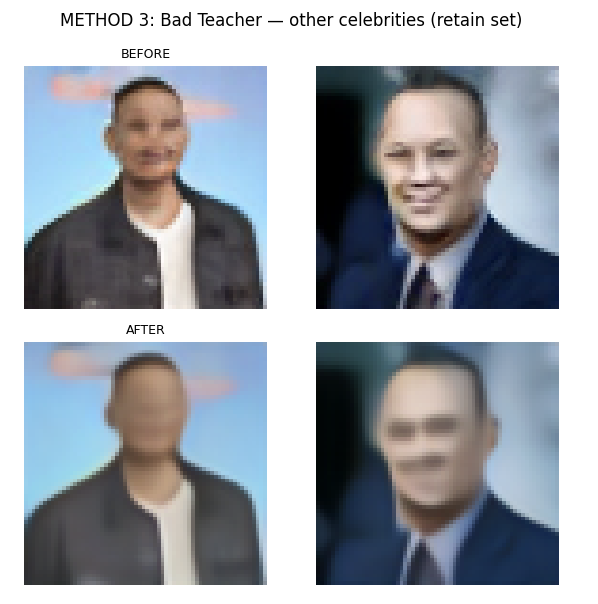
Generated in [VAE_On_Individual_Celebrities.ipynb](https://colab.research.google.com/drive/1XHcxZ6gEbUwu-8ir8mK600_5V3pONTJZ#scrollTo=ZD-mvMT1O89L).

### Figure 12 — VAE Latent Vector Injection (Celebrity Face)
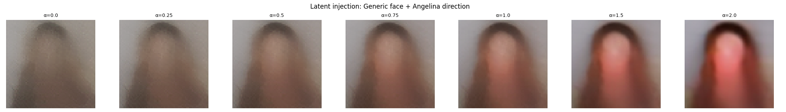
Generated in [VAE_On_Individual_Celebrities.ipynb](https://colab.research.google.com/drive/1XHcxZ6gEbUwu-8ir8mK600_5V3pONTJZ#scrollTo=-kCZXWhPvkpy).

### Figure 13 — VAE Unlearning Method Comparison Chart
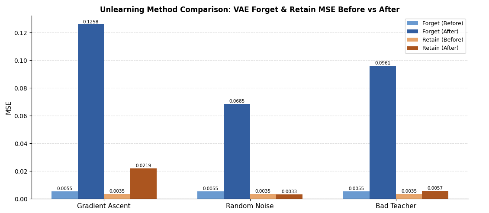
Generated in [VAE_On_Individual_Celebrities.ipynb](https://colab.research.google.com/drive/1XHcxZ6gEbUwu-8ir8mK600_5V3pONTJZ#scrollTo=3nJs4gl0Cjf7).

### Figure 14 — Glasses Latent Vector Injection
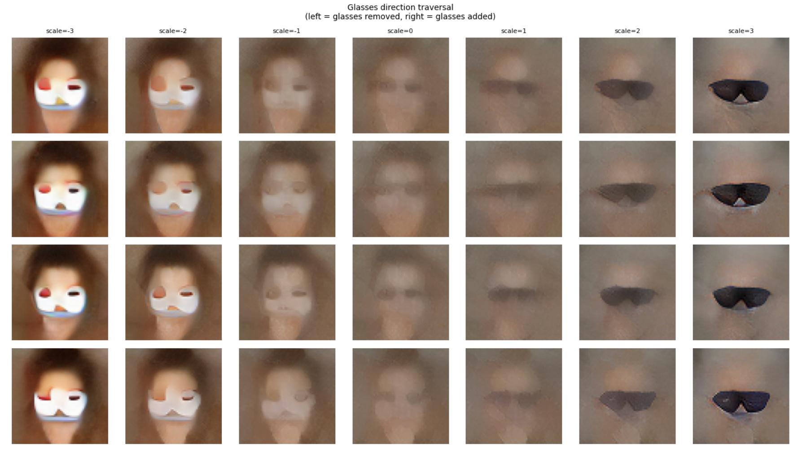
Generated in [Model_1.ipynb](https://colab.research.google.com/drive/1dYU1mzRbGL1LCxkS1nlpzf61fKku0spK#scrollTo=q5rzhnVUdlPu&uniqifier=1).

### Figure 15 — Glasses Latent Vector Injection Real Faces
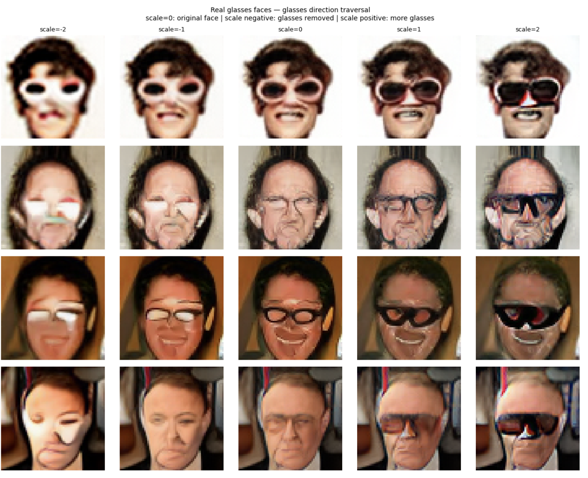
Generated in [Model_1.ipynb](https://colab.research.google.com/drive/1dYU1mzRbGL1LCxkS1nlpzf61fKku0spK#scrollTo=ZbLs5E-HkOtY&uniqifier=1).

### Figure 16 — Glasses VAE Unlearning
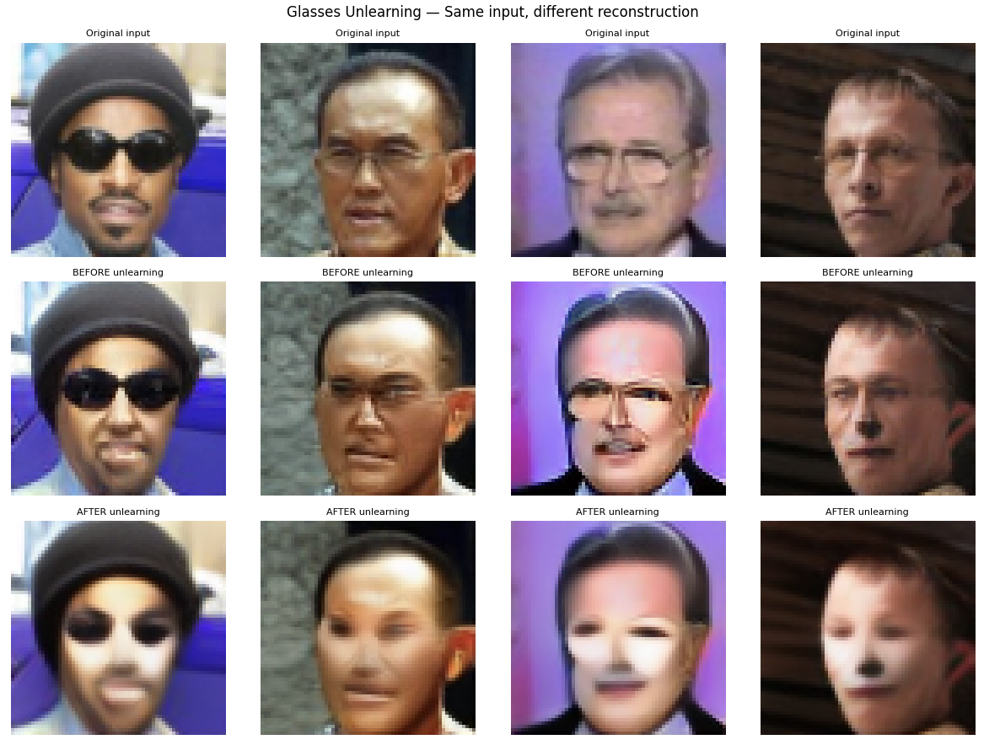
Generated in [Model_1.ipynb](https://colab.research.google.com/drive/1dYU1mzRbGL1LCxkS1nlpzf61fKku0spK#scrollTo=WmwI8TfklqeU&uniqifier=1).

### Figure 16 — Celebrity AE Model Performance on Forget Set
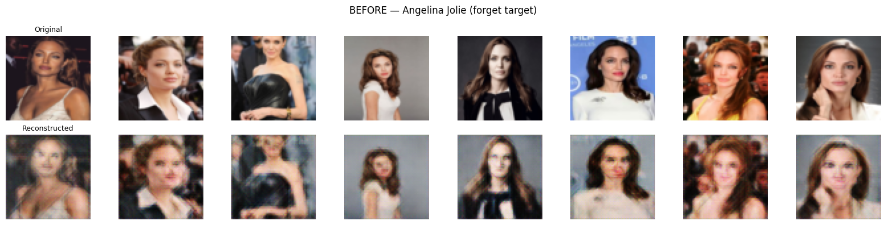
Generated in [celeb_unlearning.ipynb, Cell 16](https://vscode.dev/github/RexTabachnick/Machine-Unlearning-In-Applied-Contexts/blob/main/celeb_unlearning.ipynb#C16).

### Figure 17 — Celebrity AE Model Performance on Retain Set
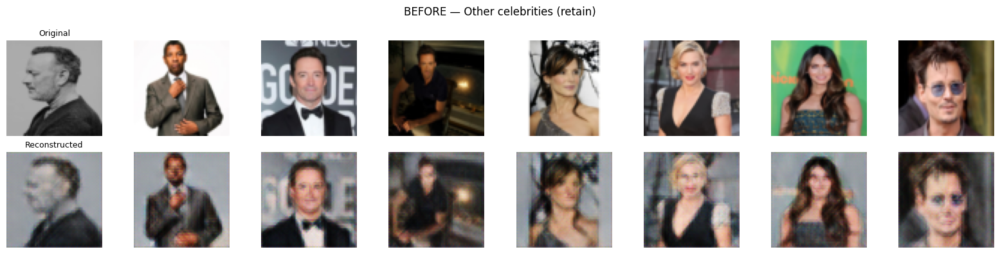
Generated in [celeb_unlearning.ipynb, Cell 16](https://vscode.dev/github/RexTabachnick/Machine-Unlearning-In-Applied-Contexts/blob/main/celeb_unlearning.ipynb#C16).

### Figure 18 — Celebrity Gradient Ascent on Forget Set
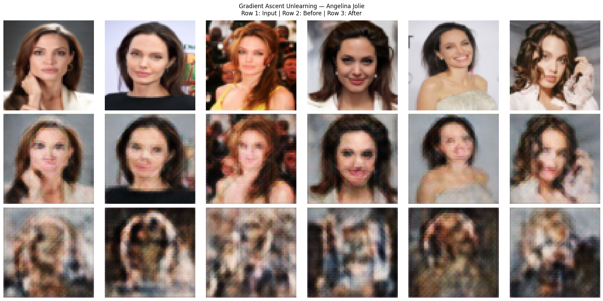
Generated in [celeb_unlearning.ipynb, Cell 23](https://vscode.dev/github/RexTabachnick/Machine-Unlearning-In-Applied-Contexts/blob/main/celeb_unlearning.ipynb#C23).

### Figure 19 — Celebrity Gradient Ascent on Retain Set
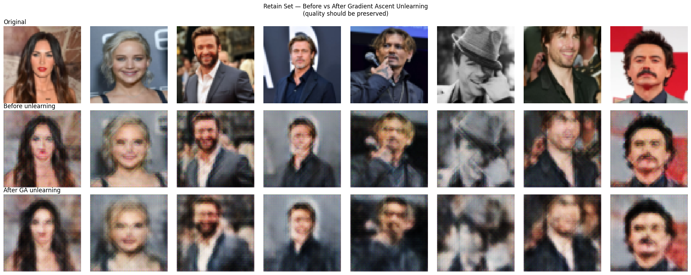
Generated in [celeb_unlearning.ipynb, Cell 24](https://vscode.dev/github/RexTabachnick/Machine-Unlearning-In-Applied-Contexts/blob/main/celeb_unlearning.ipynb#C24).

### Figure 20 — Celebrity Random Noise Targeting on Forget Set
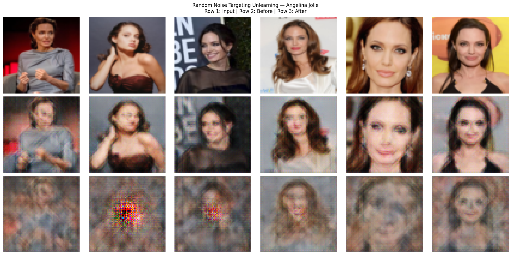
Generated in [celeb_unlearning.ipynb, Cell 30](https://vscode.dev/github/RexTabachnick/Machine-Unlearning-In-Applied-Contexts/blob/main/celeb_unlearning.ipynb#C30).

### Figure 21 — Celebrity Random Noise Targeting on Retain Set
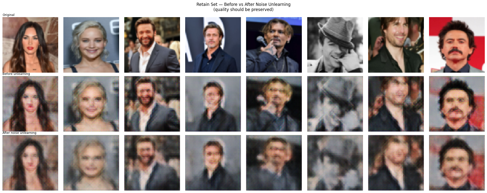
Generated in [celeb_unlearning.ipynb, Cell 29](https://vscode.dev/github/RexTabachnick/Machine-Unlearning-In-Applied-Contexts/blob/main/celeb_unlearning.ipynb#C29).

### Figure 22 — Celebrity Bad Teacher

Generated in [celeb_unlearning.ipynb, Cell 33](https://vscode.dev/github/RexTabachnick/Machine-Unlearning-In-Applied-Contexts/blob/main/celeb_unlearning.ipynb#C33).

### Figure 23 — Celebrity Good / Bad Teacher Targeting on Forget Set
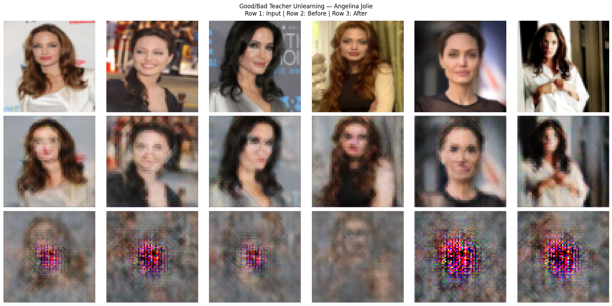
Generated in [celeb_unlearning.ipynb, Cell 38](https://vscode.dev/github/RexTabachnick/Machine-Unlearning-In-Applied-Contexts/blob/main/celeb_unlearning.ipynb#C38).

### Figure 24 — Celebrity Random Noise Targeting on Retain Set
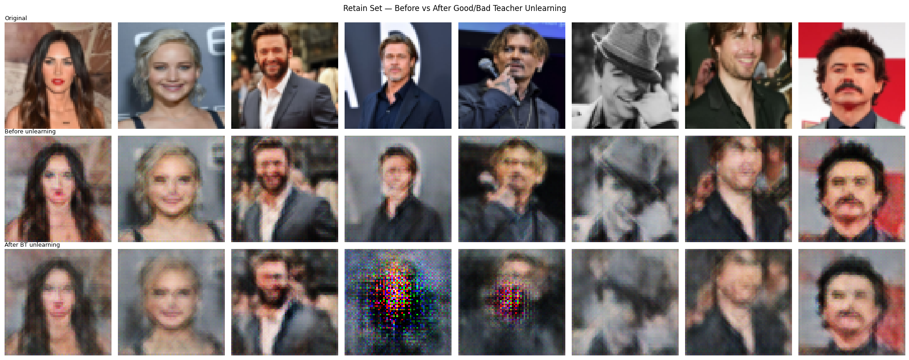
Generated in [celeb_unlearning.ipynb, Cell 37](https://vscode.dev/github/RexTabachnick/Machine-Unlearning-In-Applied-Contexts/blob/main/celeb_unlearning.ipynb#C37).

### Figure 25 — Celebrity Unlearning Comparisons on Forget Set
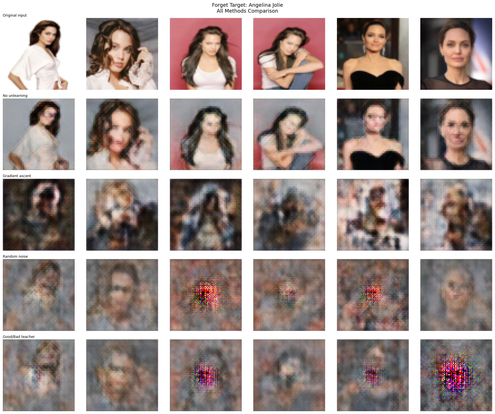
Generated in [celeb_unlearning.ipynb, Cell 40](https://vscode.dev/github/RexTabachnick/Machine-Unlearning-In-Applied-Contexts/blob/main/celeb_unlearning.ipynb#C40).

### Figure 26 — Celebrity Unlearning Comparisons on Retain Set
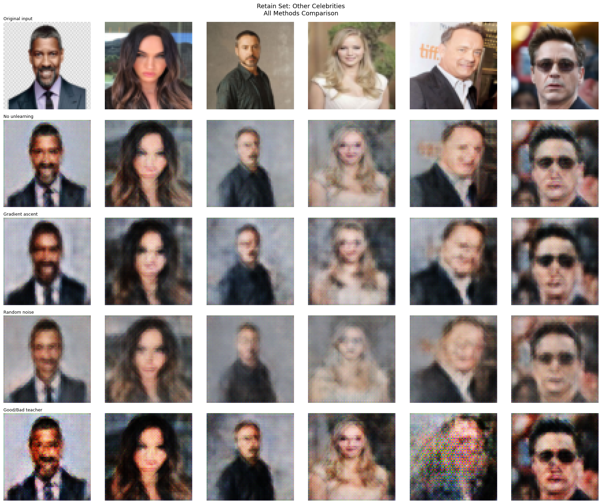
Generated in [celeb_unlearning.ipynb, Cell 41](https://vscode.dev/github/RexTabachnick/Machine-Unlearning-In-Applied-Contexts/blob/main/celeb_unlearning.ipynb#C41).